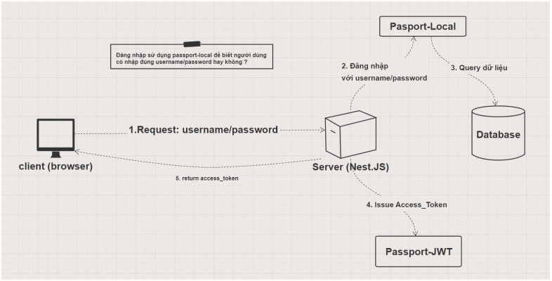
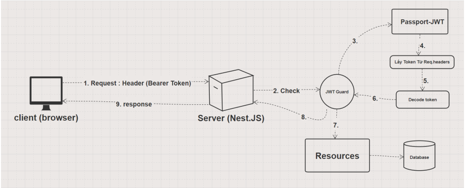

npm install --save-exact @nestjs/jwt@10.0.3 passport-jwt@4.0.1
npm install --save-dev @types/passport-jwt

1. Mô hình hoạt động của passport với Local/JWT strategy
   

2. Luồng protected routes với JWT (cần truyền lên JWT ở header request)
   

---

1. xác thực auth với jwt accesstoken:
   - Bước 1: JWT auth guard sẽ được chạy (config trong file main.ts)
     app.useGlobalGuards(new JwtAuthGuard(reflector));
   - Bước 2: Passport JWT strategy chạy (file jwt.strategy.ts)
     Nếu token hết hạn/không hợp lệ => thông báo lỗi.
     Trường hợp token hợp lệ, decode (giải mã) token => gán vào req.user
   - Bước 3 khi chạy xong validate thì chạy đến handleRequest
